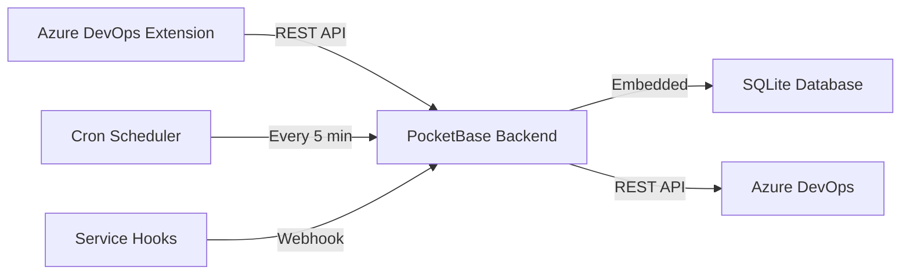
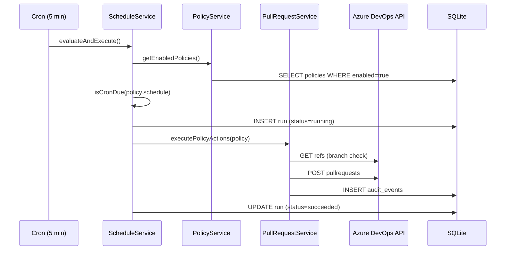

# Architecture

## System Overview

## Components

### PocketBase Backend

The backend is a Go application using PocketBase as a framework. It provides:

- **REST API** — PocketBase auto-generates CRUD endpoints for all collections
- **Admin UI** — Built-in dashboard at `/_/` for managing collections, records, and settings
- **Cron Scheduler** — Built-in `app.Cron()` runs the schedule evaluator every 5 minutes
- **Record Hooks** — `OnRecordCreate`/`OnRecordUpdate` for policy validation
- **Custom Routes** — `/api/pr-governor/*` for simulation, execution, and webhook handling

### Data Flow

### Collections

| Collection | Purpose |
|---|---|
| `policies` | Policy definitions with scope, schedule, conditions, actions |
| `runs` | Execution history for each policy invocation |
| `audit_events` | Fine-grained event log within each run |

### Services

| Service | Responsibility |
|---|---|
| `policyService` | Load, validate, and resolve effective policies |
| `scheduleService` | Orchestrate cron evaluation and policy execution |
| `pullRequestService` | Evaluate conditions, check constraints, create PRs |
| `auditService` | Record structured events for every action |

### Azure DevOps Integration

The backend communicates with Azure DevOps via the REST API (v7.1):

- **Create Pull Request** — `POST /_apis/git/repositories/{id}/pullrequests`
- **Get Refs** — `GET /_apis/git/repositories/{id}/refs` (for branch_exists conditions)

Authentication uses a PAT passed as a Basic auth header (`:` + PAT base64-encoded).
